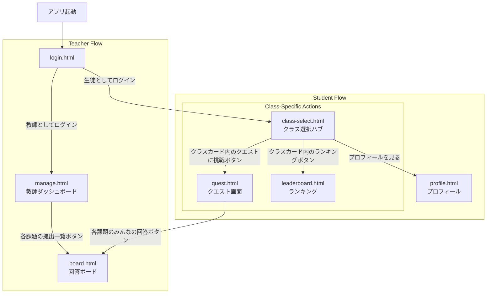

# StudyQuest 🚀

`StudyQuest`は、学校の課題管理にゲーミフィケーション要素を取り入れ、生徒の学習意欲を自然に引き出すWebアプリケーションです。

生徒はクエスト（課題）をクリアすることで経験値（XP）やトロフィーを獲得し、自身の成長をゲームのように楽しむことができます。教師は使い慣れたGoogleスプレッドシートをデータベースとして、AIのサポートを受けながら直感的に課題作成や進捗管理を行えます。

---

## ✨ 主な機能

### For Teachers 👨‍🏫
* **AIによる課題作成支援:** トピックやキーワードを入力するだけで、Gemini APIが問題文、選択肢、解説を自動で生成します。
* **直感的な進捗管理:** 生徒の提出状況やクラス全体のランキングをダッシュボードで視覚的に把握できます。
* **柔軟な生徒管理:** CSVファイルを使って、新年度のクラス名簿を一度に登録・更新できます。

### For Students 🎓
* **成長の可視化:** 課題をクリアすると経験値(XP)が貯まり、レベルアップします。自身の成長がXPバーやレベルで一目でわかります。
* **コレクション要素:** 特定の条件を達成すると「トロフィー」を獲得できます。学習のマイルストーンとして、コレクションする楽しみがあります。
* **クラス横断型のプロフィール:** 複数の先生のクラスに参加しても、XPやレベルは一つのプロフィールに集約。あなたの学習の旅は、常に継続します。
* **健全な競争:** クラス内のランキングで友達と競い合い、モチベーションを高めることができます。

---

## 🔧 アーキテクチャ概要

本システムは、Google Workspaceのサービスを最大限に活用したサーバーレスアーキテクチャで構築されています。

* **バックエンド:** Google Apps Script (GAS)
* **データベース:** Google Spreadsheet
* **フロントエンド:** GAS `HtmlService` (HTML/CSS/JavaScript)
* **AI:** Google Gemini API

特筆すべきは、**「グローバルマスターDB」**と**「教師別DB」**の2層構造を採用している点です。これにより、生徒のXPやレベルといった永続的な成長記録はシステム全体で一元管理しつつ、各教師は自身のクラス運営に集中できる設計となっています。

---

## 🚀 セットアップと使い方

1.  **リポジトリのクローンとデプロイ:**
    * 本リポジトリをクローンし、`clasp` を使ってご自身のGoogleアカウントにApps Scriptプロジェクトをデプロイします。

2.  **グローバルDBの初期化:**
    * Apps Script エディタで `createGlobalMasterDb` を実行し、`StudyQuest_Global_Master_DB` スプレッドシートを作成します。
    * 生成されたスプレッドシートIDは `GLOBAL_DB_ID` と `Global_Master_DB` の両方のプロパティとして保存されます。
    * 作成されたスプレッドシートを、StudyQuest を利用するすべての教師と共有するか、Web アプリの実行ユーザーを「自分」に設定してください。

3.  **教師としての初回ログイン:**
    * デプロイしたWebアプリのURLにアクセスし、「教師としてログイン」を実行します。
    * 初回ログイン時に、あなたのGoogle Drive内に教師用データベースが自動で作成されます。

4.  **生徒の登録:**
    * 管理画面の指示に従い、生徒の名簿（メールアドレス、名前など）を記述したCSVファイルをアップロードします。
    * これで、生徒がシステムにログインできる状態になります。

---

## 画面遷移図（改訂版）

はい、承知いたしました。生徒のハブ画面 (`class-select.html`) から自身のプロフィール画面 (`profile.html`) への遷移フローを追加し、開発者がコーディングしやすいように図と定義を書き換えます。

-----

## 1\. 設計思想

  * **生徒のハブ画面:** 生徒ログイン後、必ず\*\*`class-select.html`\*\*に遷移します。この画面は、各クラスへの入口、およびプロフィールやランキング等の関連情報へアクセスする「ハブ」として機能します。
  * **回答ボード (`board.html`) の共有:** この画面は、教師と生徒の両方からアクセス可能な共有ページとして位置づけられます。

-----

## 2\. 全体遷移図 (Overview Diagram)


-----

## 3\. 画面遷移定義テーブル (View Transition Definition Table)

| 遷移元 View           | トリガー              | 実行関数             | 遷移先 View          | 備考 / URLパラメータ                                |
| :-------------------- | :-------------------- | :------------------- | :------------------- | :-------------------------------------------------- |
| `login.html`          | \[教師としてログイン] ボタン | `onclick="loginAsTeacher()"` | `manage.html`        | 認証成功時。`?teacher=<teacherCode>` を付与。       |
| `login.html`          | \[生徒としてログイン] ボタン | `onclick="loginAsStudent()"` | `class-select.html`  | 認証成功時。在籍クラス数に関わらず必ず遷移。            |
| `login.html`          | \[生徒としてログイン] ボタン | `onclick="loginAsStudent()"` | (遷移なし)           | 在籍クラスが0の場合。エラーモーダルを表示。         |
| `class-select.html`   | \[プロフィール]ボタン   | `onclick="(なし)"`   | `profile.html`       | グローバルなプロフィール画面への直接遷移。          |
| `class-select.html`   | クラスカード内の\<br\>\[クエストに挑戦]ボタン | `onclick="(なし)"`   | `quest.html`         | `?teacher=<selectedTeacherCode>` を付与。           |
| `class-select.html`   | クラスカード内の\<br\>\[ランキングを見る]ボタン | `onclick="(なし)"`   | `leaderboard.html`   | `?teacher=<selectedTeacherCode>` を付与。           |
| `manage.html`         | 課題リストの\<br\>\[提出一覧]ボタン | `onclick="(なし)"`   | `board.html`         | `?teacher=<teacherCode>&task=<selectedTaskId>` を付与。 |
| `quest.html`          | 各課題の\<br\>\[みんなの回答を見る]ボタン | `onclick="(なし)"`   | `board.html`         | `?teacher=<teacherCode>&task=<selectedTaskId>` を付与。 |

-----

### 4\. 各フロー詳細

#### 4.1. ログインフロー (`login.html`)

  * **操作**
    ユーザーは\*\*\[教師としてログイン]**または**\[生徒としてログイン]\*\*ボタンをクリックします。

  * **教師の場合**

      * `google.script.run.loginAsTeacher()` を実行します。
      * 認証成功後、URLパラメータに `teacherCode` を付与して `manage.html` へ遷移します。

  * **生徒の場合**

      * `google.script.run.loginAsStudent()` を実行します。
      * 認証成功後、在籍クラス数に関わらず必ず `class-select.html` へ遷移します。
      * 在籍クラスがない場合は `login.html` に留まり、エラーメッセージを表示します。

#### 4.2. 生徒ハブ画面からの遷移 (`class-select.html`)

  * **画面概要**
    バックエンドから取得した在籍クラスのリストをカード形式で表示します。この画面は生徒の「ハブ」として機能し、以下の主要な遷移をサポートします。

    1.  **プロフィールを見る**
        ヘッダーやフッター、または専用ボタンなど、UI上の適切な位置に配置された\*\*\[プロフィール]**ボタンをクリックすると、**`profile.html`\*\*へ直接遷移します。

    2.  **クエストに挑戦**
        クラスカード内の\*\*\[クエストに挑戦]\*\*ボタンをクリックすると、対応する `teacherCode` を URL パラメータに付与して `quest.html` へ遷移します。

        ```text
        quest.html?teacher=<teacherCode>
        ```

    3.  **ランキングを見る**
        クラスカード内の\*\*\[ランキングを見る]\*\*ボタンをクリックすると、対応する `teacherCode` を URL パラメータに付与して `leaderboard.html` へ遷移します。

        ```text
        leaderboard.html?teacher=<teacherCode>
        ```

#### 4.3. 回答ボードへの遷移 (`board.html`)

  * **画面概要**
    特定の課題 (`taskId`) に対する全提出物を一覧表示する共有ページです。

  * **教師からの遷移**
    `manage.html` の課題リスト内\*\*\[提出一覧]\*\*ボタンをクリックすると、`board.html?teacher=<teacherCode>&task=<taskId>` へ遷移します。

  * **生徒からの遷移**
    `quest.html` の各課題\*\*\[みんなの回答を見る]\*\*ボタンをクリックすると、`board.html?teacher=<teacherCode>&task=<taskId>` へ遷移します。

---

## 🚧 今後の展望 (Roadmap)

`StudyQuest`はまだ開発の初期段階です。将来的には、以下のような機能拡張を計画しています。

* **ダッシュボードの高度化:** 教師向けに、生徒ごと・課題ごとの正答率や平均回答時間など、より詳細な分析機能を追加。
* **協力・対戦要素:** グループで協力して解く「レイドクエスト」や、生徒同士でスコアを競う「タイムアタックモード」の実装。
* **AIフィードバックの強化:** 生徒の自由記述回答に対し、AIが個別のフィードバックやアドバイスを自動生成する機能。
* **プロフィール機能の拡充:** 獲得したトロフィーを飾ったり、称号をカスタマイズしたりできる、よりリッチなプロフィール画面。

### 🤝 コントリビューション

このプロジェクトは、教育現場での学習体験をより良くしたいという思いから生まれました。機能の提案、バグ報告、プルリクエストなど、あらゆる形でのコントリビューションを歓迎します！

まずは `Issues` を確認して、気軽に参加してみてください。

## Development Setup

Tests require Node.js dependencies. You can install them by running the
following script or using `npm install` directly:

```bash
./scripts/setup-codex.sh   # or: npm install
```

After the dependencies are installed, execute the test suite with:

```bash
npm test
```

## Testing

Prerequisites:

* **Node.js** v20 or higher

Run the following commands in the project root:

```bash
npm install   # install dev dependencies
npm test      # execute Jest test suite
```

## License

This project is licensed under the [MIT License](LICENSE).
